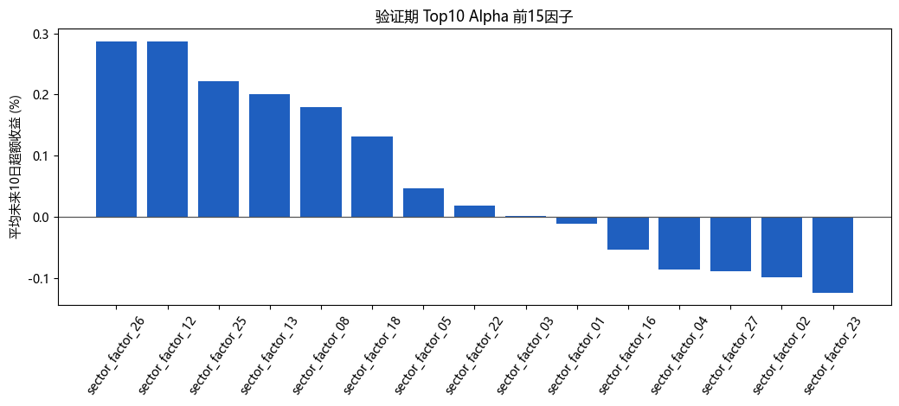
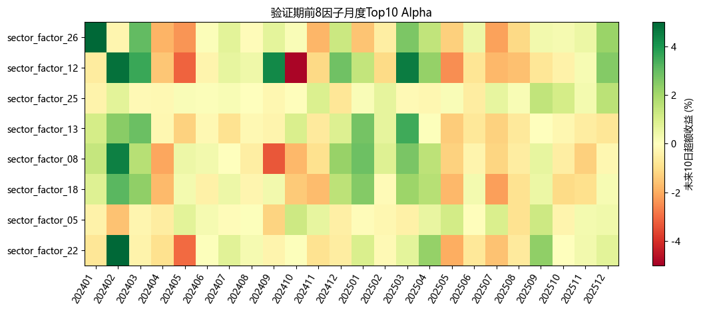

# 板块高 Alpha 因子挖掘报告

生成日期：2026-07-01

## 目的

本轮只做板块因子挖掘，不训练滚动模型。目标是找到一批能够提示板块未来 10 个交易日进入主升浪的高 alpha 因子。评价标准优先看 Top10 板块未来 10 日相对全板块均值的超额收益，而不是单纯 IC。

## 数据与目标

- 宇宙：同花顺行业 + 概念板块，类型为 `I, N`。
- 发现期：20150101 至 20231231。
- 验证期：20240101 至 20251231。
- 观察期：20260101 至 20260529，不参与筛选。
- 主标签：`future_ret_10d`。
- 主目标：Top10 未来 10 日 alpha。

## 遗传搜索设置

```text
population_size = 96
generations = 24
elite_size = 16
tournament_size = 5
crossover_rate = 0.55
mutation_rate = 0.35
max_depth = 3
library_size = 30
```

fitness 使用 robust 版：

```text
1.50 * mean(monthly_top10_alpha)
+ 0.50 * min(best_contiguous_2_month_alpha, 3%)
+ 0.50 * min(mean(top3 monthly_top10_alpha), 3%)
+ 0.02 * (positive_month_ratio - 50%)
- 0.10 * std(daily_top10_alpha)
- 0.0005 * expression_nodes
```

## 因子库概览

- 最终因子数：30
- core 因子数：6
- diagnostic 因子数：24

| 因子 | 状态 | 类别 | 发现期Top10 alpha | 验证期Top10 alpha | 验证期正月份 | 验证期Rank IC | 峰值月 | 公式 |
| --- | --- | --- | --- | --- | --- | --- | --- | --- |
| sector_factor_26 | core | trend | 0.28% | 0.29% | 58.33% | -0.0120 | 201704 | min(drawdown_60d_rank, div(div(volatility_60d, risk_adj_10_20_rank), ret_10d_rank)) |
| sector_factor_25 | core | raw_state | 0.43% | 0.22% | 62.50% | 0.0176 | 201704 | mul(neg(zscore_20(risk_adj_5_20_rank)), mul(mul(close_pos_20d_rank, volume_z_20d), ret_3d)) |
| sector_factor_08 | core | breakout | 0.39% | 0.18% | 50.00% | 0.0215 | 201802 | add(risk_adj_10_20_rank, signed_sqrt(neg(ma_gap_10_60_rank))) |
| sector_factor_18 | core | raw_state | 0.29% | 0.13% | 54.17% | 0.0186 | 201506 | add(signed_sqrt(sub(volatility_60d, ma_gap_10_60_rank)), ret_5d_rank) |
| sector_factor_22 | core | breakout | 0.18% | 0.02% | 50.00% | 0.0111 | 202004 | sub(drawdown_60d_rank, mean_5(volatility_10d_rank)) |
| sector_factor_03 | core | trend | 0.67% | 0.00% | 58.33% | 0.0441 | 201505 | mul(mul(mul(ret_3d_rank, volume_z_20d), ret_3d_rank), risk_adj_5_20_rank) |
| sector_factor_12 | diagnostic | breakout | 0.24% | 0.29% | 45.83% | 0.0493 | 201506 | mul(std_20(volatility_10d_rank), neg(ma_gap_10_60_rank)) |
| sector_factor_13 | diagnostic | breakout | 0.18% | 0.20% | 41.67% | 0.0000 | 201506 | zscore_20(ma_gap_5_20_rank) |
| sector_factor_05 | diagnostic | raw_state | 0.56% | 0.05% | 45.83% | 0.0206 | 201505 | mul(mul(ret_3d, volume_z_20d), ret_3d_rank) |
| sector_factor_01 | diagnostic | trend | 0.82% | -0.01% | 62.50% | 0.0325 | 201702 | mul(sub(mul(close_pos_20d_rank, volume_z_20d), ret_3d_rank), risk_adj_5_20_rank) |
| sector_factor_16 | diagnostic | raw_state | 0.23% | -0.05% | 41.67% | 0.0071 | 202107 | mul(slope_5(risk_adj_20_60_rank), ret_20d) |
| sector_factor_04 | diagnostic | raw_state | 0.66% | -0.09% | 45.83% | 0.0205 | 201505 | mul(ret_5d, sub(close_pos_20d_rank, volume_z_20d)) |
| sector_factor_27 | diagnostic | breakout | 0.29% | -0.09% | 45.83% | 0.0079 | 201703 | slope_5(close_pos_20d_rank) |
| sector_factor_02 | diagnostic | breakout | 0.73% | -0.10% | 58.33% | 0.0449 | 201702 | mul(sub(close_pos_20d_rank, volume_z_20d), risk_adj_5_20_rank) |
| sector_factor_23 | diagnostic | raw_state | 0.25% | -0.12% | 41.67% | 0.0259 | 201707 | mul(volatility_60d, zscore_20(volatility_20d)) |
| sector_factor_07 | diagnostic | breakout | 0.34% | -0.18% | 50.00% | -0.0001 | 201703 | mul(delta_5(close_pos_20d_rank), risk_adj_5_20_rank) |
| sector_factor_29 | diagnostic | trend | 0.20% | -0.18% | 41.67% | 0.0372 | 202012 | std_20(ret_60d_rank) |
| sector_factor_09 | diagnostic | trend | 0.27% | -0.24% | 58.33% | 0.0062 | 202001 | delta_5(ret_10d_rank) |
| sector_factor_30 | diagnostic | breakout | 0.34% | -0.27% | 33.33% | 0.0061 | 202107 | mul(mul(close_pos_20d_rank, volume_z_20d), sub(ma_gap_10_60_rank, std_20(range_1d_rank))) |
| sector_factor_06 | diagnostic | trend | 0.71% | -0.28% | 50.00% | 0.0072 | 201702 | mul(max(sub(close_pos_20d_rank, volume_z_20d), ret_3d_rank), risk_adj_5_20_rank) |
| sector_factor_15 | diagnostic | breakout | 0.52% | -0.30% | 33.33% | 0.0478 | 201509 | std_20(range_1d_rank) |
| sector_factor_14 | diagnostic | raw_state | 0.31% | -0.36% | 33.33% | 0.0143 | 202001 | volatility_60d |
| sector_factor_17 | diagnostic | trend | 0.28% | -0.38% | 37.50% | -0.0078 | 202012 | delta_5(ret_5d_rank) |
| sector_factor_10 | diagnostic | breakout | 0.30% | -0.41% | 29.17% | 0.0217 | 202001 | std_20(ma_gap_10_60_rank) |
| sector_factor_28 | diagnostic | breakout | 0.12% | -0.44% | 33.33% | -0.0604 | 202305 | std_20(close_pos_20d_rank) |
| sector_factor_19 | diagnostic | trend | 0.18% | -0.45% | 29.17% | -0.0534 | 202109 | std_20(risk_adj_10_20_rank) |
| sector_factor_24 | diagnostic | raw_state | 0.07% | -0.56% | 33.33% | -0.0395 | 201701 | ts_rank_20(ret_60d) |
| sector_factor_20 | diagnostic | raw_state | 0.27% | -0.72% | 29.17% | 0.0055 | 201701 | zscore_20(ret_3d) |
| sector_factor_21 | diagnostic | raw_state | 0.16% | -0.80% | 16.67% | 0.0053 | 201703 | slope_5(range_1d) |
| sector_factor_11 | diagnostic | raw_state | 0.29% | -0.94% | 20.83% | -0.0127 | 202012 | delta_5(ret_3d) |





## 代表性因子说明

### sector_factor_26

```text
min(drawdown_60d_rank, div(div(volatility_60d, risk_adj_10_20_rank), ret_10d_rank))
```

- 方向：`-1`
- 类别：`trend`
- 验证期 Top10 alpha：0.29%
- 验证期 Top5 alpha：0.05%
- 验证期 Top20 alpha：0.22%
- 验证期正 alpha 月份比例：58.33%
- 验证期 Rank IC：-0.0120
- 发现期峰值月份：`201704`
- 状态：`core`

### sector_factor_25

```text
mul(neg(zscore_20(risk_adj_5_20_rank)), mul(mul(close_pos_20d_rank, volume_z_20d), ret_3d))
```

- 方向：`1`
- 类别：`raw_state`
- 验证期 Top10 alpha：0.22%
- 验证期 Top5 alpha：0.25%
- 验证期 Top20 alpha：0.24%
- 验证期正 alpha 月份比例：62.50%
- 验证期 Rank IC：0.0176
- 发现期峰值月份：`201704`
- 状态：`core`

### sector_factor_08

```text
add(risk_adj_10_20_rank, signed_sqrt(neg(ma_gap_10_60_rank)))
```

- 方向：`1`
- 类别：`breakout`
- 验证期 Top10 alpha：0.18%
- 验证期 Top5 alpha：0.09%
- 验证期 Top20 alpha：0.23%
- 验证期正 alpha 月份比例：50.00%
- 验证期 Rank IC：0.0215
- 发现期峰值月份：`201802`
- 状态：`core`

### sector_factor_18

```text
add(signed_sqrt(sub(volatility_60d, ma_gap_10_60_rank)), ret_5d_rank)
```

- 方向：`1`
- 类别：`raw_state`
- 验证期 Top10 alpha：0.13%
- 验证期 Top5 alpha：0.07%
- 验证期 Top20 alpha：0.24%
- 验证期正 alpha 月份比例：54.17%
- 验证期 Rank IC：0.0186
- 发现期峰值月份：`201506`
- 状态：`core`

### sector_factor_22

```text
sub(drawdown_60d_rank, mean_5(volatility_10d_rank))
```

- 方向：`-1`
- 类别：`breakout`
- 验证期 Top10 alpha：0.02%
- 验证期 Top5 alpha：-0.18%
- 验证期 Top20 alpha：0.15%
- 验证期正 alpha 月份比例：50.00%
- 验证期 Rank IC：0.0111
- 发现期峰值月份：`202004`
- 状态：`core`

### sector_factor_03

```text
mul(mul(mul(ret_3d_rank, volume_z_20d), ret_3d_rank), risk_adj_5_20_rank)
```

- 方向：`-1`
- 类别：`trend`
- 验证期 Top10 alpha：0.00%
- 验证期 Top5 alpha：-0.13%
- 验证期 Top20 alpha：0.04%
- 验证期正 alpha 月份比例：58.33%
- 验证期 Rank IC：0.0441
- 发现期峰值月份：`201505`
- 状态：`core`

### sector_factor_12

```text
mul(std_20(volatility_10d_rank), neg(ma_gap_10_60_rank))
```

- 方向：`1`
- 类别：`breakout`
- 验证期 Top10 alpha：0.29%
- 验证期 Top5 alpha：0.40%
- 验证期 Top20 alpha：0.32%
- 验证期正 alpha 月份比例：45.83%
- 验证期 Rank IC：0.0493
- 发现期峰值月份：`201506`
- 状态：`diagnostic`

### sector_factor_13

```text
zscore_20(ma_gap_5_20_rank)
```

- 方向：`1`
- 类别：`breakout`
- 验证期 Top10 alpha：0.20%
- 验证期 Top5 alpha：0.21%
- 验证期 Top20 alpha：0.26%
- 验证期正 alpha 月份比例：41.67%
- 验证期 Rank IC：0.0000
- 发现期峰值月份：`201506`
- 状态：`diagnostic`

### sector_factor_05

```text
mul(mul(ret_3d, volume_z_20d), ret_3d_rank)
```

- 方向：`-1`
- 类别：`raw_state`
- 验证期 Top10 alpha：0.05%
- 验证期 Top5 alpha：0.02%
- 验证期 Top20 alpha：0.03%
- 验证期正 alpha 月份比例：45.83%
- 验证期 Rank IC：0.0206
- 发现期峰值月份：`201505`
- 状态：`diagnostic`

### sector_factor_01

```text
mul(sub(mul(close_pos_20d_rank, volume_z_20d), ret_3d_rank), risk_adj_5_20_rank)
```

- 方向：`-1`
- 类别：`trend`
- 验证期 Top10 alpha：-0.01%
- 验证期 Top5 alpha：-0.10%
- 验证期 Top20 alpha：0.03%
- 验证期正 alpha 月份比例：62.50%
- 验证期 Rank IC：0.0325
- 发现期峰值月份：`201702`
- 状态：`diagnostic`

### sector_factor_16

```text
mul(slope_5(risk_adj_20_60_rank), ret_20d)
```

- 方向：`-1`
- 类别：`raw_state`
- 验证期 Top10 alpha：-0.05%
- 验证期 Top5 alpha：-0.07%
- 验证期 Top20 alpha：0.00%
- 验证期正 alpha 月份比例：41.67%
- 验证期 Rank IC：0.0071
- 发现期峰值月份：`202107`
- 状态：`diagnostic`

### sector_factor_04

```text
mul(ret_5d, sub(close_pos_20d_rank, volume_z_20d))
```

- 方向：`1`
- 类别：`raw_state`
- 验证期 Top10 alpha：-0.09%
- 验证期 Top5 alpha：0.00%
- 验证期 Top20 alpha：-0.04%
- 验证期正 alpha 月份比例：45.83%
- 验证期 Rank IC：0.0205
- 发现期峰值月份：`201505`
- 状态：`diagnostic`


## 结论

本轮因子挖掘把未来 10 日 Top10 alpha 作为主目标，更贴近“板块主升浪入场信号”。`core` 因子表示发现期和验证期都有正向 Top10 alpha，`diagnostic` 因子表示发现期强但验证期不完全达标，后续可以作为模型输入或人工观察项。

下一步建议先不要急着扩大模型复杂度，而是用这些因子做两件事：

1. 看 Top10 alpha 在 2024、2025、2026 各月份是否集中在少数行情阶段。
2. 用 core 因子构造简单投票或 LightGBM 滚动模型，比较是否优于之前直接使用原始板块特征。
