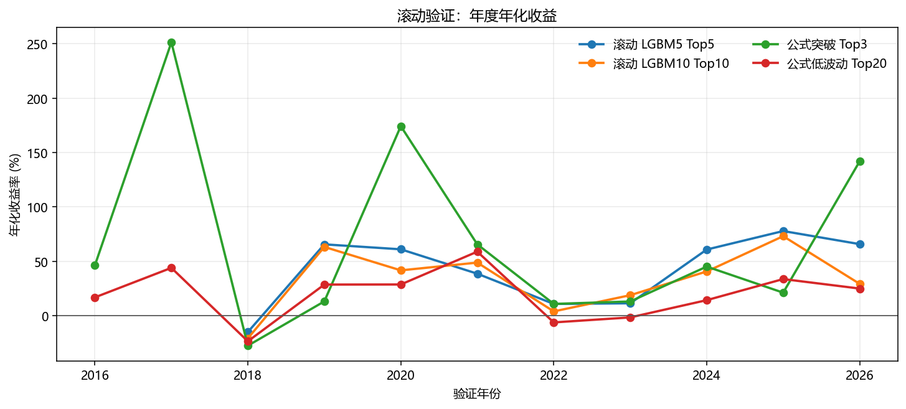
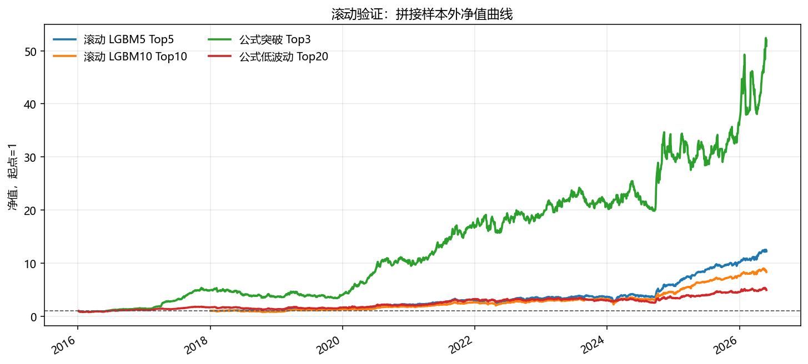

# 板块策略滚动验证补充报告

生成日期：2026-07-01

## 目的

本补充验证用于解决固定训练/验证/测试切分可能带来的偶然性问题。对机器学习策略，采用逐年 walk-forward：每一年只使用上一年年底以前已经兑现标签的数据训练模型，然后验证下一年；对公式评分策略，由于没有训练过程，直接展示 2016 年以来每一年的样本外表现。

## 滚动验证口径

- 机器学习模型：`industry_concept` 宇宙，LightGBM 回归，输入仍为板块历史状态的横截面 rank 特征。
- 训练方式：扩展窗口训练。例如验证 2024 年时，只使用 2023-12-31 及以前数据；验证 2026 年时，只使用 2025-12-31 及以前数据。
- 验证年份：机器学习从 2018 年滚动至 2026 年；2026 年只统计至 2026-05-29。
- 公式策略：不训练，直接从 2016 年统计至 2026 年。
- 收益口径：信号日收盘后选板块，下一交易日开始持有，等权组合，暂不扣手续费和滑点。

## 总体结果

| 策略 | 起始年 | 结束年 | 拼接年化 | 拼接夏普 | 最大回撤 | 日胜率 | 平均换手 | 正收益年份 |
| --- | --- | --- | --- | --- | --- | --- | --- | --- |
| 滚动 LGBM5 Top5 | 2018 | 2026 | 36.44% | 1.33 | -34.26% | 56.02% | 81.00% | 8/9 |
| 滚动 LGBM10 Top10 | 2018 | 2026 | 30.10% | 1.21 | -33.34% | 55.42% | 74.07% | 8/9 |
| 公式 行业突破 Top3 | 2016 | 2026 | 48.28% | 1.49 | -36.89% | 55.33% | 77.40% | 10/11 |
| 公式 低波动动量 Top20 | 2016 | 2026 | 17.28% | 0.80 | -33.13% | 54.93% | 45.53% | 8/11 |

## 推荐机器学习模型逐年表现

| 年份 | 交易日 | 总收益 | 年化 | 夏普 | 最大回撤 | 基准年化 | 超额年化 |
| --- | --- | --- | --- | --- | --- | --- | --- |
| 2018 | 242 | -14.42% | -14.97% | -0.45 | -27.35% | -32.85% | 26.06% |
| 2019 | 243 | 62.66% | 65.62% | 2.16 | -18.13% | 30.71% | 26.50% |
| 2020 | 242 | 58.04% | 61.06% | 1.97 | -11.85% | 17.13% | 37.04% |
| 2021 | 242 | 36.86% | 38.64% | 1.62 | -13.08% | 25.34% | 10.61% |
| 2022 | 241 | 10.34% | 10.83% | 0.53 | -22.33% | -11.97% | 25.93% |
| 2023 | 241 | 10.92% | 11.44% | 0.69 | -13.15% | 5.62% | 5.67% |
| 2024 | 241 | 57.54% | 60.84% | 1.39 | -29.60% | 4.72% | 55.09% |
| 2025 | 242 | 73.83% | 77.84% | 3.15 | -6.65% | 36.46% | 28.96% |
| 2026 | 94 | 20.76% | 65.83% | 2.41 | -5.26% | 0.22% | 64.35% |

## 代表性公式策略逐年表现

| 年份 | 年化 | 夏普 | 最大回撤 | 超额年化 |
| --- | --- | --- | --- | --- |
| 2016 | 46.37% | 1.31 | -24.80% | 40.36% |
| 2017 | 251.29% | 5.27 | -10.16% | 256.39% |
| 2018 | -27.51% | -0.99 | -35.02% | 2.73% |
| 2019 | 13.21% | 0.59 | -27.29% | -13.48% |
| 2020 | 174.25% | 3.39 | -13.06% | 128.17% |
| 2021 | 65.61% | 1.91 | -13.88% | 33.24% |
| 2022 | 10.87% | 0.53 | -17.80% | 21.09% |
| 2023 | 13.12% | 0.71 | -16.09% | 8.28% |
| 2024 | 45.17% | 1.25 | -22.07% | 35.85% |
| 2025 | 21.21% | 0.81 | -20.03% | -9.69% |
| 2026 | 141.92% | 2.26 | -23.02% | 141.80% |

## 结论

滚动验证比固定切分更接近真实使用方式。若滚动 LGBM5 Top5 在多数年份保持正收益，同时拼接样本外净值曲线没有只依赖单一年份贡献，则说明板块强度模型不是完全来自一次性参数选择。公式策略的逐年展示则用于判断简单可解释信号是否具有跨年份稳定性。

需要注意，滚动验证仍然没有扣交易成本，且板块基金仍是假设资产。下一步应把该滚动框架作为默认评估入口，并加入成本压力测试和真实 ETF 映射。
