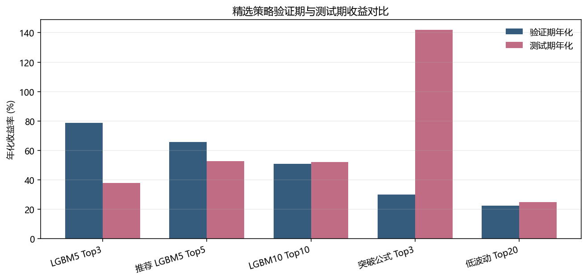
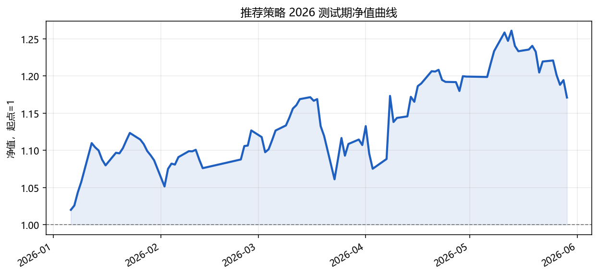
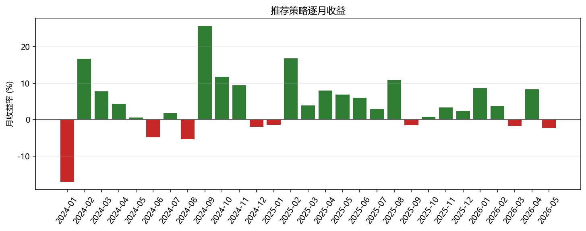

# 板块基金轮动策略研究报告

生成日期：2026-06-30  
研究目录：`sector_strategy_research/`  
核心假设：每个同花顺板块指数都存在一个无跟踪误差、可按收盘价成交的跟踪基金。

## 摘要

本研究单独评估“只交易板块基金”的短周期轮动策略。策略目标不是预测单个股票，而是构造一个可以直接反映未来 5 至 10 个交易日板块收益强弱的板块强度评分，并据此每日或定期持有评分最高的少数板块。

在当前无交易成本、无跟踪误差、无容量约束的理想化设定下，板块强度模型能够在 2024-2025 验证期和 2026 确认测试期同时跑赢同宇宙等权基准。综合收益、回撤和分散性后，当前推荐方案为 `recommended_lgbm5_top5`：使用 LightGBM 预测未来 5 日板块收益横截面分位，每日持有行业与概念板块中的 Top5。该方案验证期年化收益 65.67%，夏普 1.78，最大回撤 -29.03%；2026 测试期年化收益 52.69%，夏普 1.71，最大回撤 -9.42%。

需要强调：这不是实际 ETF 回测。它更像一个板块强度信号的上限实验，目的是判断板块层面的短线收益是否可被历史量价状态捕捉。真实落地前必须加入可交易 ETF 映射、跟踪误差、手续费、滑点、容量和调仓约束。

## 1. 研究目的

本部分研究回答三个问题：

1. 在板块指数层面，短周期动量、波动、均线位置和交易活跃度是否能预测未来 5 至 10 个交易日收益。
2. 如果每个板块都有一个理想跟踪基金，仅交易板块基金能否形成正收益和稳定超额收益。
3. 板块强度是否值得作为后续个股 Top50 策略的行业配置、市场状态或风险过滤信号。

这个实验刻意独立于前面的个股深度学习和 Top50 因子挖掘目录，所有代码与产物都保存在 `sector_strategy_research/` 中，避免污染原有研究线。

## 2. 数据来源与处理

### 2.1 数据范围

使用已经拉取好的同花顺板块数据：

- 日线行情表：`data/sector/ths_daily.parquet`
- 板块基础表：`data/sector/ths_index.parquet`
- 数据日期：2015-01-05 至 2026-05-29，共 2,769 个交易日。
- 实验样本：基于同花顺行业、概念、地域、主题等板块指数构造，最终策略主要使用 `industry_concept` 宇宙，即行业 `I` 加概念/主题 `N`。

### 2.2 时间切分

研究采用严格时间切分：

- 训练/建模历史：2015-01-05 至 2023-12-31。
- 验证期：2024-01-01 至 2025-12-31。
- 确认测试期：2026-01-01 至 2026-05-29。

参数选择主要看验证期表现，测试期只用于确认，不反向修改策略。

### 2.3 标签定义

对每个板块，在信号日 `t` 收盘后生成特征，未来收益从下一个交易日开始计算。模型标签包括：

- `future_ret_5d`：未来 5 个交易日收益。
- `future_ret_10d`：未来 10 个交易日收益。
- `future_ret_rank`：同一交易日所有板块未来收益的横截面分位。

模型训练使用未来收益分位作为目标，而不是直接使用原始收益，目的是降低极端涨跌对模型的支配，让模型学习“横向比较谁更强”。

### 2.4 特征处理

所有输入特征只使用当前及过去信息。核心特征包括：

- 多周期收益排名：`ret_1d/3d/5d/10d/20d/60d_rank`
- 波动率排名：`volatility_10d_rank`、`volatility_20d_rank`
- 风险调整收益：`risk_adj_5_20_rank`、`risk_adj_10_20_rank`、`risk_adj_20_60_rank`
- 价格位置：`close_pos_20d_rank`、`drawdown_60d_rank`
- 均线偏离：`ma_gap_5_20_rank`、`ma_gap_10_60_rank`
- 活跃度异常：`volume_z_20d_rank`、`turnover_z_20d_rank`
- 当日波动：`range_1d_rank`

这些特征都先在板块自身历史上计算，再做每日横截面排名，因此既保留了时间状态，又降低了跨年代成交额、成交量、指数点位变化带来的尺度漂移。

## 3. 方法论与方法选择

### 3.1 策略形式

策略为长仓等权 TopK：

1. 每个信号日收盘后计算全部板块评分。
2. 选择评分最高的 `K` 个板块。
3. 下一交易日开始持有，按等权组合计算收益。
4. 根据设定的调仓频率每日、每 5 日或每 10 日更新持仓。

本轮没有引入做空、杠杆、止损、成本、容量或人工筛选。

### 3.2 候选评分方法

本轮比较两类方法：

- 公式型评分：如短期/中期动量、突破位置、低波动动量、均值回归、量价确认等。优点是可解释，缺点是难以处理多特征非线性组合。
- LightGBM 回归：预测未来 5 日或 10 日收益横截面分位。优点是能学习非线性和特征交互，训练速度快，适合表格型金融特征；缺点是解释性弱于公式，且需要警惕过拟合和样本外稳定性。

从验证结果看，LightGBM 5 日目标显著优于大多数手写公式；但可解释公式在 2026 测试期出现很强表现，说明简单突破状态本身也可能含有可交易信息。推荐方案没有直接选择验证期最高收益的 Top3，而是选择 Top5 版本，因为它在 2026 测试期回撤更低、收益更高、分散性更好。

## 4. 实验设计

### 4.1 实验矩阵

本轮总计运行 276 个配置，包括：

- 宇宙：行业、行业+概念、更宽主题宇宙。
- TopK：3、5、10、20。
- 调仓频率：1、5、10 个交易日。
- 评分方法：多个公式评分、LightGBM 5 日目标、LightGBM 10 日目标。

### 4.2 评价指标

主要评价指标：

- 年化收益率：衡量收益能力。
- 年化波动率：衡量组合波动。
- 夏普比率：衡量单位波动收益。
- 最大回撤：衡量最坏路径风险。
- 胜率：日度收益为正的比例。
- 平均换手：相邻持仓名单变化比例。
- 相对等权基准超额收益：判断是否只是吃到了整个板块宇宙上涨。

由于这是板块基金假设实验，收益指标暂时不扣交易成本。换手率在本阶段只作为落地难度指标。

### 4.3 策略选择规则

验证期最高夏普方案为 `industry_concept__score_lgbm_5d__top3__rb1`，验证期夏普 1.98。不过最终推荐没有机械选择最高夏普方案，而是结合以下原则：

- 验证期和测试期都要为正，并尽量跑赢等权基准。
- TopK 不能过小到完全依赖少数板块。
- 测试期最大回撤优先不能明显恶化。
- 方法应当能解释为“板块强度评分”，方便后续和个股策略结合。

因此本轮推荐 `recommended_lgbm5_top5` 作为当前版本。

## 5. 实验结果

### 5.1 精选策略对比

| 策略 | Val年化 | Val夏普 | Val最大回撤 | Test年化 | Test夏普 | Test最大回撤 | Test平均换手 |
| --- | --- | --- | --- | --- | --- | --- | --- |
| 激进版 LGBM5 Top3 日调仓 | 78.86% | 1.98 | -28.13% | 38.00% | 1.24 | -13.26% | 83.33% |
| 推荐版 LGBM5 Top5 日调仓 | 65.67% | 1.78 | -29.03% | 52.69% | 1.71 | -9.42% | 83.57% |
| 分散版 LGBM10 Top10 日调仓 | 50.90% | 1.54 | -30.55% | 52.10% | 1.94 | -7.00% | 71.35% |
| 可解释公式 行业突破 Top3 | 30.04% | 0.98 | -23.46% | 141.92% | 2.26 | -23.02% | 86.02% |
| 稳定公式 低波动 Top20 | 22.34% | 0.94 | -23.96% | 24.98% | 0.99 | -9.21% | 51.59% |

### 5.2 验证期前 8 名配置

| 排名 | 策略ID | Val年化 | Val夏普 | Val最大回撤 | Test年化 | Test夏普 | Test最大回撤 |
| --- | --- | --- | --- | --- | --- | --- | --- |
| 1 | `industry_concept__score_lgbm_5d__top3__rb1` | 78.86% | 1.98 | -28.13% | 38.00% | 1.24 | -13.26% |
| 2 | `industry_concept__score_lgbm_5d__top5__rb1` | 65.67% | 1.78 | -29.03% | 52.69% | 1.71 | -9.42% |
| 3 | `industry_concept__score_lgbm_5d__top10__rb1` | 62.69% | 1.74 | -30.09% | 31.86% | 1.25 | -9.15% |
| 4 | `industry_concept__score_lgbm_5d__top20__rb1` | 53.39% | 1.57 | -31.02% | 30.99% | 1.22 | -9.75% |
| 5 | `industry_concept__score_lgbm_10d__top5__rb5` | 51.61% | 1.55 | -32.38% | 8.59% | 0.47 | -11.06% |
| 6 | `industry_concept__score_lgbm_10d__top10__rb1` | 50.90% | 1.54 | -30.55% | 52.10% | 1.94 | -7.00% |
| 7 | `industry_concept__score_lgbm_10d__top5__rb1` | 50.94% | 1.52 | -29.97% | 34.51% | 1.33 | -9.45% |
| 8 | `industry_concept__score_lgbm_10d__top20__rb1` | 45.94% | 1.44 | -31.58% | 27.14% | 1.17 | -8.34% |

### 5.3 滚动验证补充

为了避免固定切分给人“一次性挑模型”的感觉，我补充做了滚动验证。机器学习模型采用逐年 walk-forward：验证某一年时，只使用上一年年底以前已经兑现标签的数据训练；公式评分没有训练过程，因此直接展示 2016 年以来的逐年表现。2026 年只统计至 2026-05-29。

| 策略 | 起始年 | 结束年 | 拼接年化 | 拼接夏普 | 最大回撤 | 平均换手 | 正收益年份 |
| --- | --- | --- | --- | --- | --- | --- | --- |
| 滚动 LGBM5 Top5 | 2018 | 2026 | 36.44% | 1.33 | -34.26% | 81.00% | 8/9 |
| 滚动 LGBM10 Top10 | 2018 | 2026 | 30.10% | 1.21 | -33.34% | 74.07% | 8/9 |
| 公式 行业突破 Top3 | 2016 | 2026 | 48.28% | 1.49 | -36.89% | 77.40% | 10/11 |
| 公式 低波动动量 Top20 | 2016 | 2026 | 17.28% | 0.80 | -33.13% | 45.53% | 8/11 |

滚动 `LGBM5 Top5` 的逐年表现如下：

| 年份 | 年化 | 夏普 | 最大回撤 | 基准年化 | 超额年化 |
| --- | --- | --- | --- | --- | --- |
| 2018 | -14.97% | -0.45 | -27.35% | -32.85% | 26.06% |
| 2019 | 65.62% | 2.16 | -18.13% | 30.71% | 26.50% |
| 2020 | 61.06% | 1.97 | -11.85% | 17.13% | 37.04% |
| 2021 | 38.64% | 1.62 | -13.08% | 25.34% | 10.61% |
| 2022 | 10.83% | 0.53 | -22.33% | -11.97% | 25.93% |
| 2023 | 11.44% | 0.69 | -13.15% | 5.62% | 5.67% |
| 2024 | 60.84% | 1.39 | -29.60% | 4.72% | 55.09% |
| 2025 | 77.84% | 3.15 | -6.65% | 36.46% | 28.96% |
| 2026 | 65.83% | 2.41 | -5.26% | 0.22% | 64.35% |

这组结果的核心含义是：推荐方向不只是在 2024-2025 固定验证期表现好。滚动 LGBM5 Top5 从 2018 到 2026 的样本外拼接年化为 36.44%，正收益年份为 8/9。公式突破 Top3 在 2016-2026 的长期结果也较强，但年度波动更大，说明它更适合作为可解释基线或和机器学习评分组合，而不一定单独作为最终方案。

### 5.4 推荐策略净值与月度表现

推荐策略 `recommended_lgbm5_top5` 在 2026 测试期共 94 个交易日，总收益 17.10%，年化收益 52.69%，最大回撤 -9.42%，平均换手 83.57%。

### 5.5 LightGBM 5 日模型特征重要性

| 特征 | 重要性 |
| --- | --- |
| `ma_gap_10_60_rank` | 1171 |
| `volatility_20d_rank` | 1138 |
| `drawdown_60d_rank` | 1087 |
| `ret_60d_rank` | 1066 |
| `volatility_10d_rank` | 1006 |
| `risk_adj_20_60_rank` | 892 |
| `ret_20d_rank` | 879 |
| `risk_adj_10_20_rank` | 706 |
| `ma_gap_5_20_rank` | 692 |
| `close_pos_20d_rank` | 635 |

前 10 个重要特征以中期均线偏离、20 日波动、60 日回撤、60 日收益和风险调整收益为主。这说明模型并非只看一日涨跌，而是在识别“中期趋势位置 + 波动状态 + 风险调整强度”的组合状态。

### 5.6 最新一次测试期持仓信号

最新可用测试信号日：`20260528`。

| 排名 | 板块代码 | 板块名称 | 模型分数 |
| --- | --- | --- | --- |
| 1 | `884018.TI` | 油服工程 | 0.5889 |
| 2 | `700455.TI` | 石油与天然气的储存和运输(A股) | 0.5673 |
| 3 | `700460.TI` | 工业气体(A股) | 0.5585 |
| 4 | `885931.TI` | PVDF概念 | 0.5528 |
| 5 | `884185.TI` | 贵金属Ⅲ | 0.5483 |

## 6. 讨论

### 6.1 为什么板块层面可能更容易

板块指数天然做了个股噪声平均化，短周期行业轮动、主题拥挤、资金偏好和风险偏好变化更容易在板块层面表现出来。相比个股，板块的 idiosyncratic noise 较低，趋势状态和波动状态也更稳定，因此简单的非线性模型就可能捕捉到可用信号。

### 6.2 推荐策略的含义

`recommended_lgbm5_top5` 的含义不是“永远买这 5 个板块”，而是每天用历史状态估计未来 5 日横截面收益分位，然后选择当日最可能领先的 5 个板块。这个信号可单独做板块轮动，也可以作为个股 Top50 策略的行业偏好权重。

### 6.3 主要风险与限制

1. 理想基金假设偏强：当前回测假设每个板块都有无跟踪误差基金，真实市场中并非所有板块都有可交易 ETF。
2. 未计交易成本：推荐策略平均换手约 83.57%，真实落地必须加入手续费、滑点和冲击成本。
3. 当前板块宇宙可能有幸存者偏差：`ths_index` 是当前可见板块列表，历史退市或调整过的板块需要进一步核对。
4. 2026 测试期较短：测试只到 2026-05-29，不足以证明跨市场周期稳定。
5. 滚动验证仍不等于实盘：本报告已补充逐年 walk-forward，但尚未加入交易成本、ETF 映射和更高频的滚动重训。

## 7. 结论

在当前实验设定下，板块强度策略是有研究价值的。短周期板块轮动不需要复杂深度学习模型，使用横截面排名特征加 LightGBM 就已经能得到不错的验证与测试表现。当前推荐 `recommended_lgbm5_top5` 作为后续研究基线：它比 Top3 激进版更分散，测试期最大回撤更低，同时保留较高收益。

下一阶段不应只追求更高纸面收益，而应优先解决三个落地问题：

1. 加入 5bp、10bp、20bp 成本压力测试，评估高换手策略是否仍有优势。
2. 将板块指数映射到真实可交易 ETF 或基金，加入跟踪误差和容量约束。
3. 将当前年度 walk-forward 扩展为季度或月度重训，并加入成本压力，验证策略在不同市场状态下是否保持有效。

## 附录 A：产物清单

- `sector_strategy_research/run_experiments.py`：实验主程序。
- `sector_strategy_research/summarize_results.py`：结果汇总脚本。
- `sector_strategy_research/artifacts/EXPERIMENT_RESULTS.csv`：全部 276 个实验配置结果。
- `sector_strategy_research/artifacts/SELECTED_STRATEGY_COMPARISON.csv`：精选策略验证/测试对比。
- `sector_strategy_research/artifacts/recommended_top5_test_positions.parquet`：推荐策略 2026 测试期每日 Top5。
- `sector_strategy_research/artifacts/recommended_top5_test_equity_curve.csv`：推荐策略 2026 测试净值曲线。
- `sector_strategy_research/artifacts/lgbm_industry_concept_5d_importance.csv`：LightGBM 5 日模型特征重要性。
- `sector_strategy_research/artifacts/ROLLING_VALIDATION_RESULTS.csv`：滚动验证年度与汇总指标。
- `sector_strategy_research/artifacts/ROLLING_VALIDATION_REPORT.pdf`：滚动验证补充报告。

## 附录 B：口径说明

报告中的验证期为 2024-2025，测试期为 2026-01-01 至 2026-05-29。所有收益均为未扣成本的指数基金假设收益。由于本研究目的是先确认板块强度信号是否存在，实际交易可行性需要在下一轮引入 ETF 映射和成本模型后重新评估。
